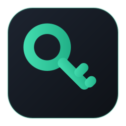
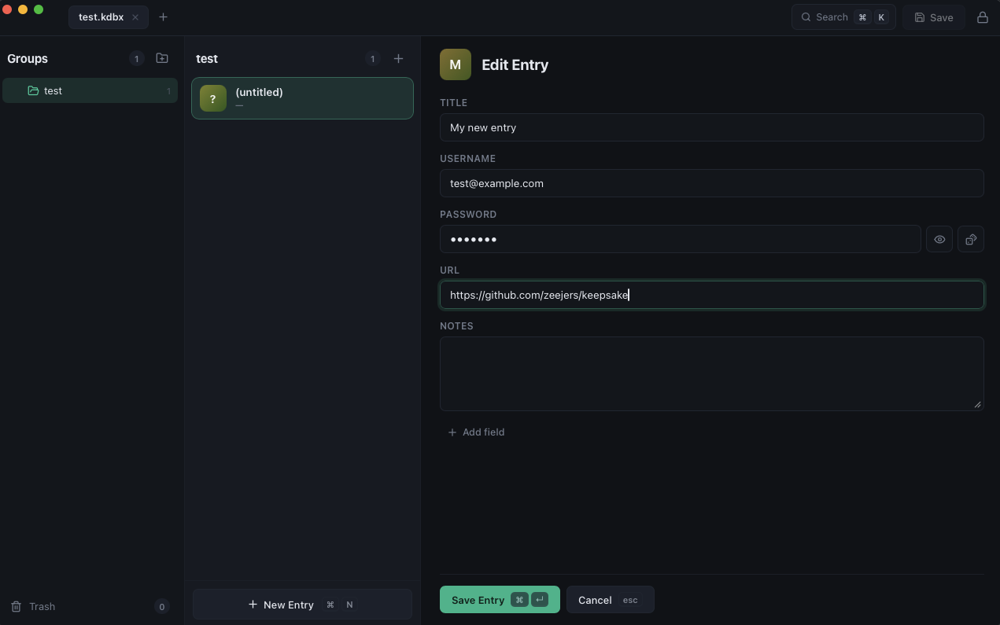

<div align="center">
  

  # Keepsake

  **A fast, keyboard-first password manager for KeePass `.kdbx` files.**
  <br/>
  Beautiful on the desktop. At home on your phone. Your storage, your secrets.

  <br/>

  [](https://github.com/zeejers/keepsake/releases/latest)
  [](LICENSE)
  [](https://tauri.app)
  [](https://github.com/zeejers/keepsake/releases/latest)

  <br/>

  **[Download](https://github.com/zeejers/keepsake/releases/latest)** · **[kdbx.app](https://kdbx.app)** · **[Privacy](https://kdbx.app/privacy/)**

  <br/>

  
</div>

---

## Why Keepsake?

I built Keepsake because I wasn't happy with the ease of use or the quality of the KeePass-based password managers out there. I wanted something that worked well cross-platform and could connect to cloud storage like Dropbox: a centralized, **bring-your-own-storage** `.kdbx` file that *isn't* sitting in the database of a big enterprise password manager company. The track record there speaks for itself: [LastPass had customers' encrypted vaults stolen outright in 2022](https://en.wikipedia.org/wiki/LastPass#Security_incidents), and it was neither the first incident nor the last across the industry.

The KeePass model gets the architecture right: **one encrypted file, an open format, and no company in the loop.** Your vault is encrypted on your device with a key derived from your master password, and the only thing that ever touches disk or cloud storage is ciphertext. There's no account to breach, no server-side database to dump, and no vendor between you and your passwords. If Keepsake disappeared tomorrow, your vault still opens in KeePassXC, KeePassium, or any of a dozen other clients. That is the point of an open format.

Keepsake's job is to make that model *pleasant*: a clean three-pane layout, first-class keyboard shortcuts, biometric unlock, and Dropbox sync that just works, on your desktop and your phone.

## Features

|  |  |
| --- | --- |
| **Your vault, unchanged** | Works directly on standard kdbx 3 & 4 files with Argon2. Fully compatible with KeePassXC, KeePassium, and the rest of the ecosystem. No import, no lock-in. |
| **Keyboard-first** | `⌘K` fuzzy search across titles, usernames, URLs, and notes; `⌘N` new entry in the current group; `⌘C`/`⌘B` copy password/username; `?` shows the full cheat sheet. |
| **Dropbox sync (BYOS)** | Connect once, open vaults straight from Dropbox on every device. Saves upload automatically, and revision-guarded writes mean simultaneous edits become conflict copies, never silent overwrites. |
| **Biometric unlock** | Touch ID on macOS: the master password lives in your system keychain, gated by biometrics with a device-password fallback. |
| **Multiple vaults** | Open several databases at once in tabs (`⌘1…⌘9` to switch), each with its own state. |
| **The full KeePass model** | Groups, entries, custom fields, file attachments, edit history, and trash, all in a clean three-pane layout with multi-select and context menus. |
| **Careful with secrets** | Clipboard auto-clears 30 seconds after copying, notes stay blurred until revealed, and a `.bak` is written beside local vaults on every save. |
| **Cross-platform** | One codebase: macOS, Windows, Linux, and Android (responsive single-pane layout on phones). |

## Downloads

Grab the latest build for your platform from **[Releases](https://github.com/zeejers/keepsake/releases/latest)**:

| Platform | Package |
| --- | --- |
| macOS (Apple Silicon / Intel) | `.dmg` |
| Windows | `.msi` / `.exe` |
| Linux | `.deb` / `.AppImage` |
| Android | `.apk` (sideload) |

> macOS builds are not yet notarized; right-click → **Open** on first launch.

## Keyboard shortcuts

| Keys | Action |
| --- | --- |
| `⌘K` / `⌘F` | Search entries and groups (fuzzy; includes usernames, notes, URLs) |
| `⌘N` | New entry (in the selected group) |
| `⌘⇧N` | New group |
| `⌘E` / `Enter` | Edit selected entry |
| `⌘↵` | Save entry (while editing) |
| `⌘C` / `⌘B` / `⌘U` | Copy password / copy username / open URL |
| `↑` `↓` / `⇧↑` `⇧↓` | Move between entries / extend selection |
| `⌘Click` / `⇧Click` / `⌘A` | Toggle / range / select all |
| `⌘1…⌘9` | Switch vault tab |
| `⌘O` | Open another vault |
| `⌘⌫` | Move selection to trash |
| `⌘S` | Save database to disk (manual; auto-save is on) |
| `⌘L` | Close current vault |
| `?` | Shortcut cheat sheet |

On Windows/Linux, use `Ctrl` instead of `⌘`.

## Dropbox setup

Keepsake talks to Dropbox as an OAuth PKCE public client: no server, no app secret, tokens stay on your device. Builds ship with a default app key, so connecting is: **Dropbox tab → Authorize in browser → paste the code**. Done.

To use your own Dropbox app instead: create one at [dropbox.com/developers/apps](https://www.dropbox.com/developers/apps) ("Scoped access"), enable `files.metadata.read`, `files.content.read`, and `files.content.write` on the Permissions tab, and paste your App key in Keepsake's Dropbox tab (or set `DEFAULT_APP_KEY` in `src/lib/dropbox.ts`).

## Development

```bash
make install       # npm install
make dev           # run the app (tauri dev)
make check         # typecheck TS + cargo check
make build         # production bundles (dmg/app/msi/deb)
make install-app   # build + install to /Applications (macOS)
make android-apk   # debug APK for sideloading (arm64)
```

Requires Node 20+ and a Rust toolchain; Android builds additionally need the Android SDK + NDK.

### Try it with a demo vault

```bash
node scripts/make-demo.mjs   # writes demo.kdbx (password: demo)
make dev
```

`node scripts/smoke-kdbx.mjs` runs a headless round-trip test of the crypto layer (create → save → reload, attachments, wrong-password rejection).

### Releasing

Pushing a `v*` tag runs `.github/workflows/release.yml`, which builds macOS (arm64 + x86_64), Windows, and Linux bundles via `tauri-action` and attaches them to a draft GitHub release. macOS signing/notarization activates when the `APPLE_*` secrets are configured.

## Architecture

```
src/
  lib/kdbx.ts        kdbxweb + argon2 glue; VaultSource abstraction (file | dropbox)
  lib/argon2.worker.ts   key derivation in a Web Worker so the UI never freezes
  lib/dropbox.ts     OAuth PKCE + Dropbox API (search / download / rev-guarded upload)
  stores/vault.ts    Pinia store; vault sessions (tabs) with per-vault UI state.
                     kdbxweb objects live outside Vue reactivity; the store derives
                     plain view-models keyed on a revision counter
  components/        UnlockScreen (open/Dropbox/create), Sidebar, EntryList,
                     EntryDetail, SearchPalette, HelpOverlay, PromptModal, Toast
src-tauri/           Tauri v2 shell (dialog, fs, clipboard, opener plugins +
                     Touch ID via LocalAuthentication/Keychain on macOS)
docs/                kdbx.app landing page + privacy policy (GitHub Pages)
```

The Rust side is a thin shell; all kdbx parsing happens in the webview via [kdbxweb](https://github.com/keeweb/kdbxweb), so the same code path backs desktop and mobile alike.

## Security notes

- Crypto is delegated to [kdbxweb](https://github.com/keeweb/kdbxweb) (the library behind KeeWeb) with Argon2 via [hash-wasm](https://github.com/Daninet/hash-wasm); key derivation runs in a Web Worker.
- Touch ID stores the master password in the macOS login Keychain (scoped to this app) behind a LocalAuthentication prompt.
- Dropbox only ever receives the same encrypted bytes your disk would; encryption happens on-device, before upload.
- Clipboard contents are cleared 30 seconds after copying a secret.
- This project has **not** been independently security-audited. Use at your own risk.

## License

[MIT](LICENSE). Keepsake is an independent project and is not affiliated with KeePass or Dropbox.
